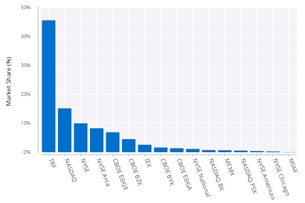

# Simple Bar Chart
In this example, we are going to create a basic bar chart to show the market share of all exchanges in the U.S. equities market on November 17, 2020. The final chart looks like below:

<span style="display:block;text-align:center">

</span>

## Overview of Data
The table ``.bar.mktShare20201117`` has the following schema:

    c       | t f a
    --------| -----
    exchange| s    
    mktShare| f 

The first 3 rows from the table are as shown below.

    exchange  mktShare  
    --------------------
    CBOE BYX  0.01644091
    CBOE BZX  0.04529426
    CBOE EDGA 0.01375766

The first column ``exchange`` is the name of each trading venue and the second column ``mktShare`` is the market share on Nov 17, 2020.

## Step 1: Initial Attempt
A basic bar chart is implemented by [``.qp.bar``](https://code.kx.com/developer/libraries/grammar-of-graphics-geometries/#qpbar). The code below shows an example of vanilla bar chart without any customization.

```q
// .bar.basic01
.qp.go[600;400;]
  .qp.bar[.bar.mktShare20201117;`exchange;`mktShare;::]
```

<span style="display:block;text-align:center">

</span>

There are a couple of areas we can improve this bar chart:

- Customize the look of both axis labels
- Show the *y*-axis tick values as percentage
- Rotate the *x*-axis tick values to make them more readable
- Sort the bar chart from the largest to the smallest according to market share

## Step 2: Customize Labels
In this step, we customize the axis labels and the tick values on the *y*-axis. Specifically,

- Change the *y*-axis label to ``Market Share (%)``
- Remove the *x*-axis labels
- Format the scale on the *y*-axis as percentage

```q
// .bar.basic02
yfmt:{`$string[floor 0.5+100*x],"%"};

.qp.go[600;400;]
  .qp.bar[.bar.mktShare20201117;`exchange;`mktShare;]
     .qp.s.labels[`x`y!("";"Market Share (%)")]
    ,.qp.s.scale[`y;.gg.scale.format[yfmt;] .gg.scale.linear]
```

<span style="display:block;text-align:center">

</span>

## Step 3: Rotate Tick Values
The function [``.qp.bar``](https://code.kx.com/developer/libraries/grammar-of-graphics-geometries/#qpbar) does not provide a property in its settings to rotate the tick values. We provide a way to achieve this by using [``.qp.text``](https://code.kx.com/developer/libraries/grammar-of-graphics-geometries/#qptext) to superimpose text annotation to the bar chart. The following changes are put into place:

- Remove the original tick values on the *x*-axis
- Customize the *x*-axis tick values by text annotations
- Align the tick values to the left and rotate by 70 degrees
- Add more space to the bottom of the chart for the display exchange names

```q
// .bar.basic03
t:update y:0 from .bar.mktShare20201117;
xfmt:{""};
yfmt:{`$string[floor 0.5+100*x],"%"};

.qp.go[600;400;]
  .qp.theme[``padding_bottom!(::;50)]
  .qp.stack (
    .qp.bar[t;`exchange;`mktShare;]
       .qp.s.labels[`x`y!("";"Market Share (%)")]
      ,.qp.s.scale[`y;.gg.scale.format[yfmt;] .gg.scale.linear]
      ,.qp.s.scale[`x;.gg.scale.format[xfmt;] .gg.scale.categorical[]];
    .qp.text[t;`exchange;`y;`exchange]
       .qp.s.geom[`offsety`align`size`angle!(10;`left;12;70)]
      ,.qp.s.labels[`x`y!("";"Market Share (%)")]
    )
```

<span style="display:block;text-align:center">

</span>

## Step 4: Sort the Bar
To sort the bar in a descending order, we need to make a few changes:

- Sort the original table by market share in descending order
- Use the row index as the value for the *x*-axis. Note that the bar chart will be automatically sorted in ascending order if the *x*-axis values are of categorical type.

```q
// .bar.basic04
t:update x:i,y:0 from `mktShare xdesc .bar.mktShare20201117;
xfmt:{""};
yfmt:{`$string[floor 0.5+100*x],"%"};

.qp.go[600;400;]
  .qp.theme[``padding_bottom!(::;50)]
  .qp.stack (
    .qp.bar[t;`x;`mktShare;]
       .qp.s.labels[`x`y!("";"Market Share (%)")]
      ,.qp.s.scale[`y;.gg.scale.format[yfmt;] .gg.scale.linear]
      ,.qp.s.scale[`x;.gg.scale.format[xfmt;] .gg.scale.categorical[]];
    .qp.text[t;`x;`y;`exchange]
       .qp.s.geom[`offsety`align`size`angle!(10;`left;12;70)]
      ,.qp.s.labels[`x`y!("";"Market Share (%)")]
    )
```

<span style="display:block;text-align:center">

</span>

## Final Step: Update Bar Color
Now we change the bar color to navy blue to conclude this example.

```q
// .bar.basicFinal
t:update x:i,y:0 from `mktShare xdesc .bar.mktShare20201117;
xfmt:{""};
yfmt:{`$string[floor 0.5+100*x],"%"};

.qp.go[600;400;]
  .qp.theme[``padding_bottom!(::;50)]
  .qp.stack (
    .qp.bar[t;`x;`mktShare;]
       .qp.s.geom[``fill!(::;0x0070cd)]
      ,.qp.s.labels[`x`y!("";"Market Share (%)")]
      ,.qp.s.scale[`y;.gg.scale.format[yfmt;] .gg.scale.linear]
      ,.qp.s.scale[`x;.gg.scale.format[xfmt;] .gg.scale.categorical[]];
    .qp.text[t;`x;`y;`exchange]
       .qp.s.geom[`offsety`align`size`angle!(10;`left;12;70)]
      ,.qp.s.labels[`x`y!("";"Market Share (%)")]
    )
```

<span style="display:block;text-align:center">

</span>
