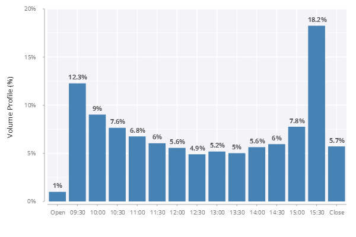
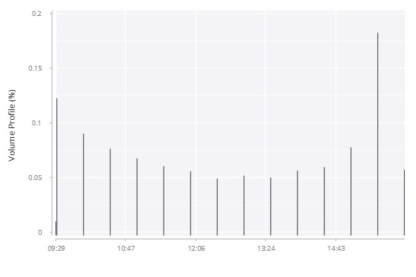
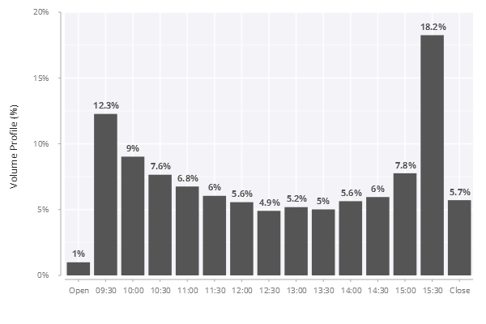

# Bar Chart with Data Labels
In this example, we are going to create a bar chart with data labels to show the volume percent for each 30-minute interval and the open/close auctions. The final chart looks like below:

<span style="display:block;text-align:center">

</span>

## Overview of Data
The table ``.bar.volumeProfile`` has the following schema:

    c     | t f a
    ------| ----- 
    time  | u    
    volpct| f  

The first 3 rows from the table are as shown below.

    time  volpct    
    ----------------
    09:29 0.00995   
    09:30 0.12266   
    10:00 0.09020523

The value corresponding to ``09:29`` is for open auction and the value for ``16:00`` is for close auction. The ``time`` column indicates the start time of each 30-minute time interval.

## Step 1: Initial Attempt
A basic bar chart is implemented by [``.qp.bar``](https://code.kx.com/developer/libraries/grammar-of-graphics-geometries/#qpbar). The code below shows an example of vanilla bar chart without any customization.

```q
// .bar.dataLabel01
t:select from .bar.volumeProfile;

.qp.go[600;400;]
  .qp.bar[t;`time;`volpct;::]
```

<span style="display:block;text-align:center">

</span>

There are a couple of areas we can improve this bar chart:

- Customize the look of both axis labels
- Show the *y*-axis tick values as percentage
- Customize the tick values
- Update the bar color

## Step 2: Customize Axis Labels
In this step, we remove the *x*-axis label since the tick values are self-explanatory. A custom *y*-axis label is used to replace the column name from the data table.

```q
// .bar.dataLabel02
t:select from .bar.volumeProfile;

.qp.go[600;400;]
  .qp.bar[t;`time;`volpct;]
    .qp.s.labels[`x`y!("";"Volume Profile (%)")]
```

<span style="display:block;text-align:center">

</span>

## Step 3: Customize Tick Values
In this step, we format the tick values on the *y*-axis as percentage. On *x*-axis, the tick value for ``09:29`` is formatted as ``Open`` and that for ``16:00`` is formatted as ``Close`` and all other minutes are formatted to a string.

```q
// .bar.dataLabel03
t:select from .bar.volumeProfile;
xfmt:{$[x=09:29;"Open";x=16:00;"Close";string x]};
yfmt:{`$string[floor 0.5+100*x],"%"};

.qp.go[600;400;]
  .qp.bar[t;`time;`volpct;]
     .qp.s.labels[`x`y!("";"Volume Profile (%)")]
    ,.qp.s.scale[`x; .gg.scale.format[xfmt] .gg.scale.categorical[]]
    ,.qp.s.scale[`y; .gg.scale.format[yfmt] .gg.scale.linear]
```

<span style="display:block;text-align:center">

</span>

## Step 4: Add Data Labels
This step uses [``.qp.text``](https://code.kx.com/developer/libraries/grammar-of-graphics-geometries/#qptext) to add data label to the bar chart. Note that we create new column ``z`` for the data label, which is formatted as a proper percentage.

```q
// .bar.dataLabel04
labelFmt:{`$string[0.1*floor 0.5+1000*x],"%"};
t:update z:labelFmt each volpct from .bar.volumeProfile;
xfmt:{$[x=09:29;"Open";x=16:00;"Close";string x]};
yfmt:{`$string[floor 0.5+100*x],"%"};

.qp.go[600;400;]
  .qp.stack(
    .qp.bar[t;`time;`volpct;]
       .qp.s.labels[`x`y!("";"Volume Profile (%)")]
      ,.qp.s.scale[`x; .gg.scale.format[xfmt] .gg.scale.categorical[]]
      ,.qp.s.scale[`y; .gg.scale.format[yfmt] .gg.scale.linear];
 
    .qp.text[t;`time;`volpct;`z]
       .qp.s.geom[``offsety`align`bold`size!(::;-10;`middle;1b;11)]
      ,.qp.s.labels[`x`y!("";"Volume Profile (%)")]
      ,.qp.s.scale[`y; .gg.scale.format[yfmt] .gg.scale.linear]
    )
```

<span style="display:block;text-align:center">

</span>

## Step Final: Update the Bar Color


```q
// .bar.dataLabelFinal
labelFmt:{`$string[0.1*floor 0.5+1000*x],"%"};
t:update z:labelFmt each volpct from .bar.volumeProfile;
xfmt:{$[x=09:29;"Open";x=16:00;"Close";string x]};
yfmt:{`$string[floor 0.5+100*x],"%"};

.qp.go[600;400;]
  .qp.stack(
    .qp.bar[t;`time;`volpct;]
       .qp.s.geom[``fill`decorations!(::;`steelblue;0b)]
      ,.qp.s.labels[`x`y!("";"Volume Profile (%)")]
      ,.qp.s.scale[`x; .gg.scale.format[xfmt] .gg.scale.categorical[]]
      ,.qp.s.scale[`y; .gg.scale.format[yfmt] .gg.scale.linear];
 
    .qp.text[t;`time;`volpct;`z]
       .qp.s.geom[``offsety`align`bold`size!(::;-10;`middle;1b;11)]
      ,.qp.s.labels[`x`y!("";"Volume Profile (%)")]
    )
```

<span style="display:block;text-align:center">

</span>
