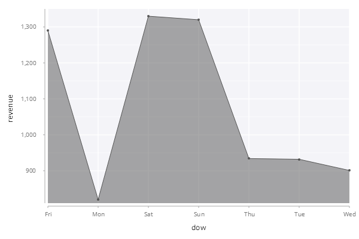
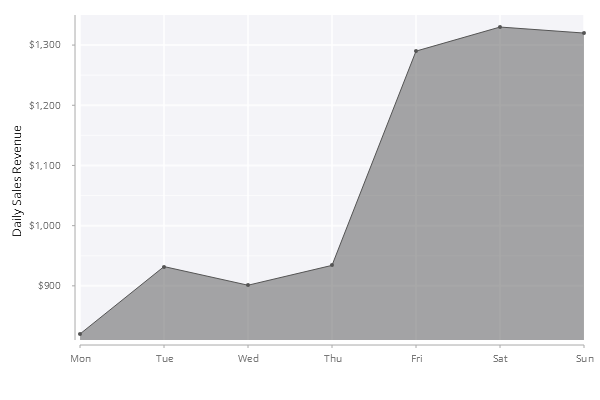
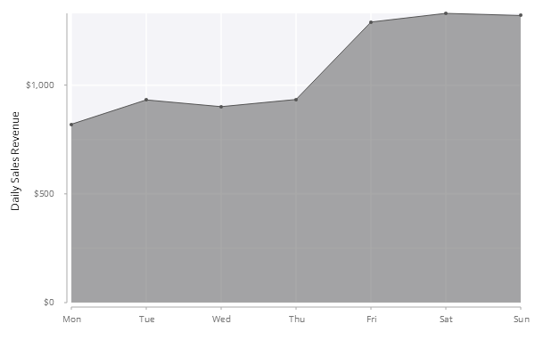

# Basic Area Chart
In this example, we are going to create a basic area chart to show the daily sales revenue of a coffee shop over a week. The final chart looks like below:

<span style="display:block;text-align:center">

</span>

## Overview of Data
The table ``.area.salesRevenue`` has the following schema:

    c      | t f a
    -------| -----
    dow    | s    
    revenue| j 

The first 3 rows from the table are as shown below.

    dow revenue
    -----------
    Mon 820    
    Tue 932    
    Wed 901 

The first column ``dow`` is day of week and the second column ``revenue`` is daily sales revenue in dollars.

## Step 1: First Attempt
The function [``.qp.area``](https://code.kx.com/developer/libraries/grammar-of-graphics-geometries/#qparea) creates an area chart. The following code snippet creates the area chart of sales revenue against the day of week without any customization.

```q
.qp.go[600;400;]
  .qp.area[.area.salesRevenue;`dow;`revenue;::]
```

<span style="display:block;text-align:center">

</span>

There are a few improvements on this area chart we can make:

- Customize the *y*-axis label and tick values
- Remove the *x*-axis label since it is not necessary
- Sort the data points from Monday to Sunday

## Step 2: Customize Axis Labels
The last line with [``.qp.s.labels``](https://code.kx.com/developer/libraries/grammar-of-graphics-layer-settings/#qpslabels) is added in the code snippet below to customize the axis labels. Note that a null symbol is used for the *x*-axis to suppress the label.

```q
.qp.go[600;400;]
  .qp.area[.area.salesRevenue;`dow;`revenue;]
    .qp.s.labels[`x`y!(`;`$"Daily Sales Revenue")]
```

<span style="display:block;text-align:center">

</span>

## Step 3: Format Tick Values
In this step, we add a function to format the displayed tick values on the *y*-axis, *i.e.* comma is used as the thousands separator and a dollar sign ($) is prepended.

```q
fmt:{"$",reverse "," sv 0N 3#reverse string x};

.qp.go[600;400;]
  .qp.area[.area.salesRevenue;`dow;`revenue;]
     .qp.s.labels[`x`y!(`;`$"Daily Sales Revenue")]
    ,.qp.s.scale[`y;.gg.scale.format[fmt] .gg.scale.linear]
```

<span style="display:block;text-align:center">

</span>

## Step 4: Reorder *x*-Axis Values
The function [``.gg.scale.categorical``](https://code.kx.com/developer/libraries/grammar-of-graphics-scales/#ggscalecategorical) takes a function which returns the new order of the categorical values.

```q
fmt:{"$",reverse "," sv 0N 3#reverse string x};

.qp.go[600;400;]
  .qp.area[.area.salesRevenue;`dow;`revenue;]
     .qp.s.labels[`x`y!(`;`$"Daily Sales Revenue")]
    ,.qp.s.scale[`y;.gg.scale.format[fmt] .gg.scale.linear]
    ,.qp.s.scale[`x;.gg.scale.categorical[{`Mon`Tue`Wed`Thu`Fri`Sat`Sun}]]
```

After adding the last line in code above, the data is displayed properly from Monday to Sunday.

<span style="display:block;text-align:center">

</span>

## Step 5: Start the Scale at Zero
The function [``.gg.scale.limits``](https://code.kx.com/developer/libraries/grammar-of-graphics-scale-settings/#ggscalelimits) is used to control the limits (minimum and maximum) for a scale. If either limit provided is null, the minimum or maximum values will be used as in usual.

```q
fmt:{"$",reverse "," sv 0N 3#reverse string x};

.qp.go[600;400;]
  .qp.area[.area.salesRevenue;`dow;`revenue;]
     .qp.s.labels[`x`y!(`;`$"Daily Sales Revenue")]
    ,.qp.s.scale[`y;.gg.scale.format[fmt] .gg.scale.limits[0 0N] .gg.scale.linear]
    ,.qp.s.scale[`x;.gg.scale.categorical[{`Mon`Tue`Wed`Thu`Fri`Sat`Sun}]]
```

<span style="display:block;text-align:center">

</span>

## Step 6: Customize Break Points
The function [``.gg.scale.breaks``](https://code.kx.com/developer/libraries/grammar-of-graphics-scale-settings/#ggscalebreaks) customizes the tick values used for the scale.
```q
fmt:{"$",reverse "," sv 0N 3#reverse string x};

.qp.go[600;400;]
  .qp.area[.area.salesRevenue;`dow;`revenue;]
     .qp.s.labels[`x`y!(`;`$"Daily Sales Revenue")]
    ,.qp.s.scale[`y;.gg.scale.format[fmt] 
                    .gg.scale.limits[0 0N] 
                    .gg.scale.breaks[200*til 7] 
                    .gg.scale.linear]
    ,.qp.s.scale[`x;.gg.scale.categorical[{`Mon`Tue`Wed`Thu`Fri`Sat`Sun}]]
```

<span style="display:block;text-align:center">

</span>

## Step Final: Change Area Color
The function [``.qp.s.geom``](https://code.kx.com/developer/libraries/grammar-of-graphics-layer-settings/#qpsgeom) creates a chart setting which has a property ``fill`` to specify the area color.

```q
fmt:{"$",reverse "," sv 0N 3#reverse string x};

.qp.go[600;400;]
  .qp.area[.area.salesRevenue;`dow;`revenue;]
     .qp.s.geom[``fill!(::;`red)]
    ,.qp.s.labels[`x`y!(`;`$"Daily Sales Revenue")]
    ,.qp.s.scale[`y;.gg.scale.format[fmt] 
                    .gg.scale.limits[0 0N] 
                    .gg.scale.breaks[200*til 7] 
                    .gg.scale.linear]
    ,.qp.s.scale[`x;.gg.scale.categorical[{`Mon`Tue`Wed`Thu`Fri`Sat`Sun}]]
```

<span style="display:block;text-align:center">

</span>
