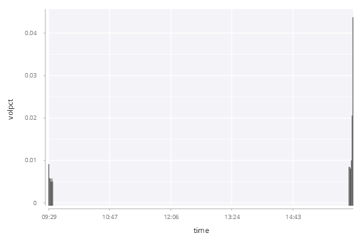

# Volume Distribution Around Auctions

In this example, we are going to create a bar chart to show and constrast the volume distribution around open and close auctions before, on and after the presidential election days in the United States in 2016 and 2020. The final chart looks like below:

## Data
The table ``.ex001.data`` has the following schema:

```q
c     | t f a
------| -----
date  | d    
time  | u    
volpct| f  
```

The first 3 rows from the table look like this:

```q
date       time  volpct     
----------------------------
2016.11.07 09:29 0.0116136  
2016.11.07 09:30 0.005534212
2016.11.07 09:31 0.005412753
```

## Version 1
Let's create a bar chart. Note that ``date`` has a *date* type and ``time`` is of type *minute* which is continuous type.

```q
t:select from .ex001.data where date=2020.11.03;
.qp.go[600;400;] .qp.bar[t;`time;`volpct;::]
```

The above vanilla code creates a basic bar chart using data from November 3, 2020. The chart is as follows:

<span style="display:block;text-align:center">

</span>

One immediate problem with the chart above is that the bars are clustered at the two sides of the chart because the dataset only contains the data around open auction at 09:30 and close auction at 16:00. This leaves a huge empty space between the two clusters and make the chart really hard to read.

## Version 2
One way to get rid of the empty space is to convert the ``time`` column from type *minute* to a categorical type like string or symbol. Let's modify the code slightly by converting the ``time`` column into a *symbol*:

```q
t:select from .ex001.data where date=2020.11.03;
t:update `$string time from t;
.qp.go[600;400;] .qp.bar[t;`time;`volpct;::]
```

<span style="display:block;text-align:center">

</span>