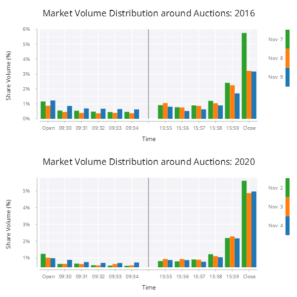
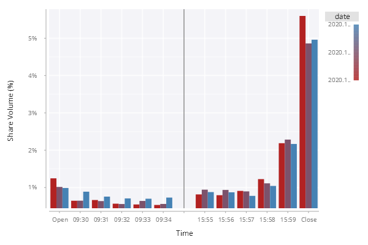

# Volume Distribution Around Auctions

In this example, we are going to create a bar chart to show and constrast the equities volume distribution around open and close auctions before, on and after the presidential election days in the United States in 2016 and 2020. The final chart looks like below:

<span style="display:block;text-align:center">

</span>

## Data
The table ``.ex001.data`` has the following schema:

```q
c     | t f a
------| -----
date  | d    
time  | u    
volpct| f  
```

The first 3 rows from the table look like this:

```q
date       time  volpct     
----------------------------
2016.11.07 09:29 0.0116136  
2016.11.07 09:30 0.005534212
2016.11.07 09:31 0.005412753
```

## Step 1
Let's create a bar chart. Note that ``date`` has a *date* type and ``time`` is of type *minute* which is continuous type.

```q
// .ex001.f01
t:select from .ex001.data where date=2020.11.03;
.qp.go[600;400;] .qp.bar[t;`time;`volpct;::]
```

The above vanilla code creates a basic bar chart using data from November 3, 2020. The chart is as follows:

<span style="display:block;text-align:center">

</span>

One immediate problem with the chart above is that the bars are clustered at the two sides of the chart because the dataset only contains the data around open auction at 09:30 and close auction at 16:00. This leaves a huge empty space between the two clusters and make the chart really hard to read.

## Step 2
// .ex001.f02
One way to get rid of the empty space is to convert the ``time`` column from type *minute* to a categorical type like *string* or *symbol*. Let's modify the code slightly by converting the ``time`` into a *symbol* type:

```q
t:select from .ex001.data where date=2020.11.03;
t:update `$string time from t;
.qp.go[600;400;] .qp.bar[t;`time;`volpct;::]
```

With this change in place, the bar chart looks much better.

<span style="display:block;text-align:center">

</span>

## Step 3
By default, the column names are used as the axis labels. In our example, meaning of the ``y`` axis label ``volpct`` is not very obvious. In this step, I will show how to customize the axis labels. We use ``.qp.s.labels`` to customize the appreance of labels. Note that we use ``.qp.bar[t;`time;`volpct;]`` as a function projection.

```q
// .ex001.f03
t:select from .ex001.data where date=2020.11.03;
t:update `$string time from t;
.qp.go[600;400;] 
  .qp.bar[t;`time;`volpct;]
    .qp.s.labels[`x`y!(`Time;`$"Share Volume (%)")]
```

Now the bar chart looks like this:

<span style="display:block;text-align:center">

</span>

## Step 4
The values on the ``y`` axis is actually percentage, *i.e.* 0.02 means 2%. It looks nicer if the tick values on the ``y`` axis are rendered as percentage by adding a percent sign in string format. The function ``.qp.s.scale`` will do the trick.

```q
// .ex001.f04
t:select from .ex001.data where date=2020.11.03;
t:update `$string time from t;
yfmt:{`$string[floor 0.5+100*x],"%"};
.qp.go[600;400;] 
  .qp.bar[t;`time;`volpct;]
     .qp.s.labels[`x`y!(`Time;`$"Share Volume (%)")]
    ,.qp.s.scale[`y;.gg.scale.format[yfmt;] .gg.scale.linear]
```

A function ``yfmt`` is defined to format a float number as percentage. 

<span style="display:block;text-align:center">

</span>

## Step 5
To make the volume bars more distinguishable between volume around open auction and volume around close auction, we can add a veritical divider to clearly separate the two clusters.

```q
// .ex001.f05
t:select from .ex001.data where date=2020.11.03;
t:update `$string time from t;
yfmt:{`$string[floor 0.5+100*x],"%"};
.qp.go[600;400;]
  .qp.stack (
    .qp.bar[t;`time;`volpct;]
       .qp.s.labels[`x`y!(`Time;`$"Share Volume (%)")]
      ,.qp.s.scale[`y;.gg.scale.format[yfmt;] .gg.scale.linear];
    .qp.vline[12:00;::]
    )
```

We add a vertical line and stack the bar and line on top of each other to produce the chart like below. As you can see that I use ``12:00`` as the x-axis value in this example. Actually any value between ``09:34`` and ``15:55`` surfices. 

<span style="display:block;text-align:center">

</span>

## Step 6
We have two problems with the tick labels on the x-axis: 

- It is quite weird that a tick label is shown for the divider.
- It is much more informative if open auction is labelled as *Open* and close auction is labelled as *Close*, instead of ``09:29`` and ``16:00``, respectively.

Let's fix that.

```q
// .ex001.f06
t:select from .ex001.data where date=2020.11.03;
t:update `$string time from t;
xfmt:{$[-17h=type x;`;x=`$"09:29";`Open;x=`$"16:00";`Close;x]};
yfmt:{`$string[floor 0.5+100*x],"%"};

.qp.go[600;400;]
  .qp.stack (
    .qp.bar[t;`time;`volpct;]
       .qp.s.labels[`x`y!(`Time;`$"Share Volume (%)")]
      ,.qp.s.scale[`x;.gg.scale.format[xfmt;.gg.scale.categorical[]]]
      ,.qp.s.scale[`y;.gg.scale.format[yfmt;.gg.scale.linear]];
    .qp.vline[12:00;::]
    )
```

After a x-axis tick formatter is added, the bar chart looks much better.

<span style="display:block;text-align:center">

</span>

## Step 7
A sharp-eyed reader may notice that there is a trailing comma in y-axis label and the x-axis label changes from "Time" to "Time, x" after the bar and vertical line are stacked on top of each other. This does not look good. Let's see how that can be fixed.

```q
// .ex001.f07
t:select from .ex001.data where date=2020.11.03;
t:update `$string time from t;
xfmt:{$[-17h=type x;`;x=`$"09:29";`Open;x=`$"16:00";`Close;x]};
yfmt:{`$string[floor 0.5+100*x],"%"};

.qp.go[600;400;]
  .qp.stack (
    .qp.bar[t;`time;`volpct;]
       .qp.s.labels[`x`y!(`Time;`$"Share Volume (%)")]
      ,.qp.s.scale[`x;.gg.scale.format[xfmt;.gg.scale.categorical[]]]
      ,.qp.s.scale[`y;.gg.scale.format[yfmt;.gg.scale.linear]];
    .qp.vline[12:00;]
       .qp.s.labels[`x`y!(`Time;`$"Share Volume (%)")]
    )
```

<span style="display:block;text-align:center">

</span>

## Step 8
So far, we have finished a nice-looking bar chart using data from a single day. How about plotting data from multiple days on the same chart? One way it is to dodge the overlapping bars side-to-side. Let's try putting the data for the three days around 2020 presidential election together in one single bar chart.

```q
// .ex001.f08
t:select from .ex001.data where 2020=`year$date;
t:update `$string time from t;
xfmt:{$[-17h=type x;`;x=`$"09:29";`Open;x=`$"16:00";`Close;x]};
yfmt:{`$string[floor 0.5+100*x],"%"};

.qp.go[600;400;]
  .qp.stack (
    .qp.bar[t;`time;`volpct;]
       .qp.s.geom[``position!(::;`dodge)]
      ,.qp.s.aes[`fill`group;`date`date]
      ,.qp.s.labels[`x`y!(`Time;`$"Share Volume (%)")]
      ,.qp.s.scale[`x;.gg.scale.format[xfmt;.gg.scale.categorical[]]]
      ,.qp.s.scale[`y;.gg.scale.format[yfmt;.gg.scale.linear]];
    .qp.vline[12:00;]
       .qp.s.labels[`x`y!(`Time;`$"Share Volume (%)")]
    )
```
The chart below has three days of data, but there are a few problems with it:

- The label for the legend is only partially shown
- The color of the legend is a gradient from a color spectrum. It is not easy to distinguish them.

<span style="display:block;text-align:center">

</span>

## Step 9
Let's fix the two issues from the previous step by converting ``date`` into a categorical type. Note that ``.qdate.print`` is used to format a date. For additional details on the data parsing functions, see [Date Parsing][DateParser].

```q
// .ex001.f09
t:select from .ex001.data where 2020=`year$date;
t:update .qdate.print["%b %e";] each date,`$string time from t;
xfmt:{$[-17h=type x;`;x=`$"09:29";`Open;x=`$"16:00";`Close;x]};
yfmt:{`$string[floor 0.5+100*x],"%"};

.qp.go[600;400;]
  .qp.stack (
    .qp.bar[t;`time;`volpct;]
       .qp.s.geom[``position!(::;`dodge)]
      ,.qp.s.aes[`fill`group;`date`date]
      ,.qp.s.labels[`x`y!(`Time;`$"Share Volume (%)")]
      ,.qp.s.scale[`x;.gg.scale.format[xfmt;.gg.scale.categorical[]]]
      ,.qp.s.scale[`y;.gg.scale.format[yfmt;.gg.scale.linear]];
    .qp.vline[12:00;]
       .qp.s.labels[`x`y!(`Time;`$"Share Volume (%)")]
    )
```

With the changes above, the color looks nicer and the legend label is clear and clean.

<span style="display:block;text-align:center">

</span>

## Step 10
In this step, I will make two more updates to the bar chart:

- Remove the ``date`` in the legend title
- Add a chart title

```q
// .ex001.f10
t:select from .ex001.data where 2020=`year$date;
t:update .qdate.print["%b %e";] each date,`$string time from t;
xfmt:{$[-17h=type x;`;x=`$"09:29";`Open;x=`$"16:00";`Close;x]};
yfmt:{`$string[floor 0.5+100*x],"%"};
ll:reverse exec distinct date from t; / legend label

.qp.go[600;400;]
  .qp.title["Market Volume Distribution around Auctions: 2020"]
  .qp.theme[`legend_header_background_fill`legend_padding_top!(`white;-20)]
  .qp.stack (
    .qp.bar[t;`time;`volpct;]
       .qp.s.geom[``position!(::;`dodge)]
      ,.qp.s.aes[`fill`group;`date`date]
      ,.qp.s.theme[``legend_use!(::;0b)]
      ,.qp.s.labels[`x`y!(`Time;`$"Share Volume (%)")]
      ,.qp.s.scale[`x;.gg.scale.format[xfmt;.gg.scale.categorical[]]]
      ,.qp.s.scale[`y;.gg.scale.format[yfmt;.gg.scale.linear]];
    .qp.vline[12:00;]
       .qp.s.labels[`x`y!(`Time;`$"Share Volume (%)")]
      ,.qp.s.legend["";ll!count[ll]#.gg.colour.cat10]
    )
```

<span style="display:block;text-align:center">

</span>

## Step 11

```q
// .ex001.f11
.qp.go[600;600;]
  .qp.vertical(
    .ex001.f10 2016;
    .ex001.f10 2020
    )
```

<span style="display:block;text-align:center">

</span>

## Variations

### Legend title

Instead of adding the year to the plot title, we can also use year as the legend title.

```q
t:select from .ex001.data where 2020=`year$date;
t:update .qdate.print["%b %e";] each date,`$string time from t;
xfmt:{$[-17h=type x;`;x=`$"09:29";`Open;x=`$"16:00";`Close;x]};
yfmt:{`$string[floor 0.5+100*x],"%"};
ll:reverse exec distinct date from t; / legend label

.qp.go[600;400;]
  .qp.title["Market Volume Distribution around Auctions"]
  .qp.stack (
    .qp.bar[t;`time;`volpct;]
       .qp.s.geom[``position!(::;`dodge)]
      ,.qp.s.aes[`fill`group;`date`date]
      ,.qp.s.theme[``legend_use!(::;0b)]
      ,.qp.s.labels[`x`y!(`Time;`$"Share Volume (%)")]
      ,.qp.s.scale[`x;.gg.scale.format[xfmt;.gg.scale.categorical[]]]
      ,.qp.s.scale[`y;.gg.scale.format[yfmt;.gg.scale.linear]];
    .qp.vline[12:00;]
       .qp.s.labels[`x`y!(`Time;`$"Share Volume (%)")]
      ,.qp.s.legend["2020";ll!count[ll]#.gg.colour.cat10]
    )
```

And the chart look like this:

<span style="display:block;text-align:center">

</span>

### Color of the divider
Instead of using the default grey color for the vertical divider, we can customize the color.

```q
t:select from .ex001.data where 2020=`year$date;
t:update .qdate.print["%b %e";] each date,`$string time from t;
xfmt:{$[-17h=type x;`;x=`$"09:29";`Open;x=`$"16:00";`Close;x]};
yfmt:{`$string[floor 0.5+100*x],"%"};
ll:reverse exec distinct date from t; / legend label

.qp.go[600;400;]
  .qp.title["Market Volume Distribution around Auctions: 2020"]
  .qp.theme[`legend_header_background_fill`legend_padding_top!(`white;-20)]
  .qp.stack (
    .qp.bar[t;`time;`volpct;]
       .qp.s.geom[``position!(::;`dodge)]
      ,.qp.s.aes[`fill`group;`date`date]
      ,.qp.s.theme[``legend_use!(::;0b)]
      ,.qp.s.labels[`x`y!(`Time;`$"Share Volume (%)")]
      ,.qp.s.scale[`x;.gg.scale.format[xfmt;.gg.scale.categorical[]]]
      ,.qp.s.scale[`y;.gg.scale.format[yfmt;.gg.scale.linear]];
    .qp.vline[12:00;]
       .qp.s.geom[``fill!(::;`blue)]
      ,.qp.s.labels[`x`y!(`Time;`$"Share Volume (%)")]
      ,.qp.s.legend["";ll!count[ll]#.gg.colour.cat10]
    )
```

The chart below indicates the color of the divider is changed to be blue.

<span style="display:block;text-align:center">

</span>

### Same y-axis
To make it easier to compare the change of volume distribution year over year, the same y-axis should be used. You can use ``.qs.s.share`` to force the same axis is used across different charts.

```q
.ex001.f12:{[yyyy]
  t:select from .ex001.data where yyyy=`year$date;
  t:update .qdate.print["%b %e";] each date,`$string time from t;
  xfmt:{$[-17h=type x;`;x=`$"09:29";`Open;x=`$"16:00";`Close;x]};
  yfmt:{`$string[floor 0.5+100*x],"%"};
  ll:reverse exec distinct date from t; / legend label

  .qp.title["Market Volume Distribution around Auctions: ",string yyyy]
  .qp.theme[`legend_header_background_fill`legend_padding_top!(`white;-20)]
  .qp.stack (
    .qp.bar[t;`time;`volpct;]
       .qp.s.geom[``position!(::;`dodge)]
      ,.qp.s.aes[`fill`group;`date`date]
      ,.qp.s.share[`auctionVol;`y]
      ,.qp.s.theme[``legend_use!(::;0b)]
      ,.qp.s.labels[`x`y!(`Time;`$"Share Volume (%)")]
      ,.qp.s.scale[`x;.gg.scale.format[xfmt;.gg.scale.categorical[]]]
      ,.qp.s.scale[`y;.gg.scale.format[yfmt;.gg.scale.linear]];
    .qp.vline[12:00;]
       .qp.s.geom[``fill!(::;`blue)]
      ,.qp.s.labels[`x`y!(`Time;`$"Share Volume (%)")]
      ,.qp.s.legend["";ll!count[ll]#.gg.colour.cat10]
    )
  };

.qp.go[600;600;]
  .qp.vertical(
    .ex001.f12 2016;
    .ex001.f12 2020
    )
```

After forcing the same y-axis, the two sub-plots have the same maximum tick label of 6%.

<span style="display:block;text-align:center">

</span>

[DateParser]: https://code.kx.com/developer/libraries/date-parser/
