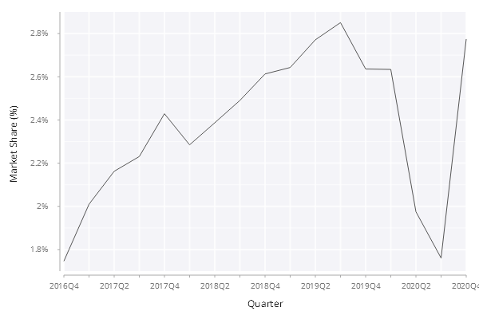
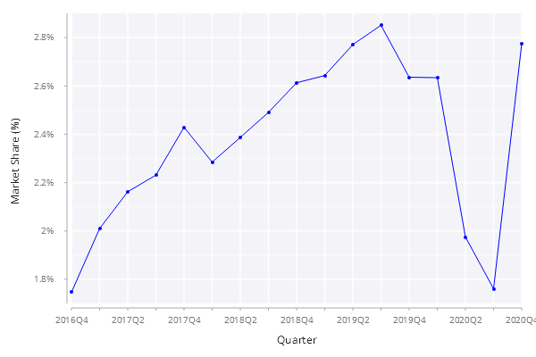

# Basic Line Chart

In this example, we are going to create a basic line chart to show the quarterly market share of Investors Exchange in U.S. equities market since it was launched in 2016. The final chart looks like below:

<span style="display:block;text-align:center">

</span>

## Overview of Data
The table ``.line.iexMktShare`` has the following schema:

    c      | t f a
    -------| -----
    quarter| s    
    mktshr | f 

The first 3 rows from the table are as shown below.

    quarter mktshr    
    ------------------
    2016Q4  0.0174625 
    2017Q1  0.02009825
    2017Q2  0.02162242

## Step 1: First Attempt
Let's get started with our first attempt to plot a line of market share against time using the default settings.

```q
// .line.basic.f01
.qp.go[600;400;]
  .qp.line[.line.iexMktShare;`quarter;`mktshr;::]
```

A basic line chart is created as below.

<span style="display:block;text-align:center">

</span>

There are a few places we can do better to improve this basic line chart:

- Update the ``x`` and ``y`` axis label to make them more readable
- Format the *y*-axis tick as percentage, *.i.e.* replacing ``0.022`` with ``2.2%``
- The *x*-axis tick values are too crowded
- Show the data points as a small empty circle

Let's see how we can achieve the above improvements.

## Step 2: Customize Axis Labels
By default, the column names are used as the axis labels. In this step, I will show how to customize the axis labels. We use ``.qp.s.labels`` to customize the appreance of labels.

```q
// .line.basic.f02
.qp.go[600;400;]
  .qp.line[.line.iexMktShare;`quarter;`mktshr;]
    .qp.s.labels[`x`y!(`Quarter;`$"Market Share (%)")]
```

By adding the last line in the above code snippet, the labels on both *x*-axis and *y*-axis look much nicer.

<span style="display:block;text-align:center">

</span>

## Step 3: Customize the Tick Values
In this step, we make two changes:

- The tick values on the *y*-axis are rendered as percentage by adding a percent sign in string format
- Every other tick values are displayed on the *x*-axis to make it less crowded

```q
// .line.basic.f03
xfmt:{n:`long$last string x;$[0=n mod 2;x;`]};
yfmt:{`$string[0.1*floor 0.5+1000*x],"%"};
  
.qp.go[600;400;]
  .qp.line[.line.iexMktShare;`quarter;`mktshr;]
     .qp.s.labels[`x`y!(`Quarter;`$"Market Share (%)")]
    ,.qp.s.scale[`x;.gg.scale.format[xfmt;.gg.scale.categorical[]]]
    ,.qp.s.scale[`y;.gg.scale.format[yfmt;] .gg.scale.linear]
```

The last two lines with ``.qp.s.scale`` customize the look of tick values on both *x*-axis and *y*-axis.

<span style="display:block;text-align:center">

</span>

## Step 4: Adding Data Points
The geometry settings allow us to show the data points and customize the color of the line and points.

```q
xfmt:{n:`long$last string x;$[0=n mod 2;x;`]};
yfmt:{`$string[0.1*floor 0.5+1000*x],"%"};

.qp.go[600;400;]
  .qp.line[.line.iexMktShare;`quarter;`mktshr;]
     .qp.s.geom[`fill`decorations!(`blue;1b)]
    ,.qp.s.labels[`x`y!(`Quarter;`$"Market Share (%)")]
    ,.qp.s.scale[`x;.gg.scale.format[xfmt;.gg.scale.categorical[]]]
    ,.qp.s.scale[`y;.gg.scale.format[yfmt;] .gg.scale.linear]
```

The geometry setting ``.qp.s.geom`` above enables displaying the points and sets the color of the line and points to blue.

<span style="display:block;text-align:center">

</span>

## Step Final: Customize the Points

To show points as empty circle, two changes are made:

- The fill color is white
- The outline color is red

```q
// .line.basic.ff
xfmt:{n:`long$last string x;$[0=n mod 2;x;`]};
yfmt:{`$string[0.1*floor 0.5+1000*x],"%"};

.qp.go[600;400;]
  .qp.title["IEX Market Share Since Its Inception"]
  .qp.stack (
    .qp.line[.line.iexMktShare;`quarter;`mktshr;]
       .qp.s.geom[`fill`decorations!(`blue;0b)]
      ,.qp.s.labels[`x`y!(`Quarter;`$"Market Share (%)")]
      ,.qp.s.scale[`x;.gg.scale.format[xfmt;.gg.scale.categorical[]]]
      ,.qp.s.scale[`y;.gg.scale.format[yfmt;] .gg.scale.linear];
    .qp.point[t;`quarter;`mktshr;]
       .qp.s.geom[`colour`fill`size`shape`strokewidth!(`red;`white;3;`circle;1)]
      ,.qp.s.labels[`x`y!(`Quarter;`$"Market Share (%)")]
    )
```

Here is the final line chart with data points. A title is also added into the chart.

<span style="display:block;text-align:center">

</span>