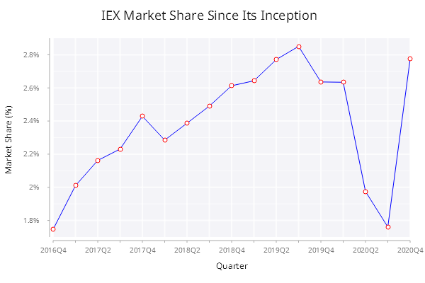

# Basic Line
In this example, we are going to create a basic line chart to show the market share of Investors Exchange in U.S. equities market. The final chart looks like below:

<span style="display:block;text-align:center">

</span>

## Data
The table ``.line.iexMktShare`` has the following schema:

    c      | t f a
    -------| -----
    quarter| s    
    mktshr | f 

The first 3 rows from the table are as shown below.

    quarter mktshr    
    ------------------
    2016Q4  0.0174625 
    2017Q1  0.02009825
    2017Q2  0.02162242

## Step 1
Let's get started with our first attempt to plot a line of market share against time.

```q
// .line.basic.f01
.qp.go[600;400;]
  .qp.line[.line.iexMktShare;`quarter;`mktshr;::]
```

A basic line chart is created as below.

<span style="display:block;text-align:center">

</span>

There are a few places we can do better to improve this basic line chart:

- Update the ``x`` and ``y`` axis label to make them more readable
- Format the y-axis tick as percentage, *.i.e.* replacing ``0.022`` with ``2.2%``
- The x-axis tick values are too crowded
- Show the data points as a small empty circle

Let's see how we can achieve the above improvements.

## Step 2
