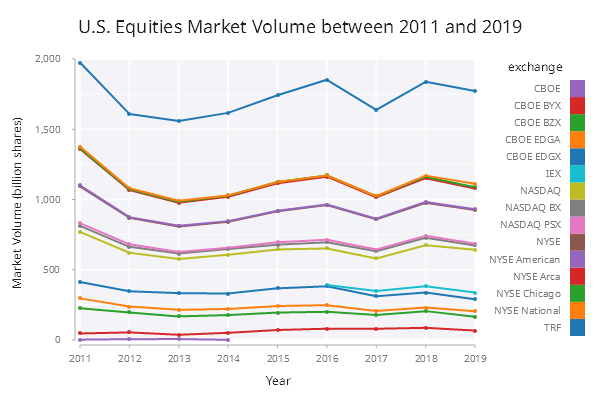

# Stacked Line Chart

In this example, we are going to create a stacked line chart to show the yearly market volume of the U.S. equities market between 2011 and 2019. The final chart looks like below:

<span style="display:block;text-align:center">

</span>

## Overview of Data
The table ``.line.mktVolume`` has the following schema:

    c       | t f a
    --------| -----
    year    | j    
    exchange| s    
    shares  | f 

The first 3 rows from the table are as shown below.

    year exchange      shares       
    --------------------------------
    2019 NYSE Chicago  7.923022e+009
    2019 NYSE National 2.48449e+010 
    2019 TRF           6.601719e+011

## Step 1: First Attempt
In this step, we simply calculate the cumulative volume traded by each exchange in each year and create a stacked line chart. Notice we sort the data by year and exchange first before the cumulative volume is calculated. A line is plotted for each exchange against year.

```q
t:0!update sums shares by year from 
  `year`exchange xasc select from .line.mktVolume;
  
.qp.go[600;400;]
  .qp.line[t;`year;`shares;] 
    .qp.s.aes[`group`fill; `exchange`exchange]
```

Without any customization, the stacked line chart is shown as below:

<span style="display:block;text-align:center">

</span>

There are a couple of aspects we can improve upon this chart:

- Customize the axis labels
- Transform the *y*-axis values to display them properly
- Adjust the width and height of legend to make it less crowded
- Add markers to the data points

## Step 2: Labels and Values
First we convert the numerical year into a string to avoid the decimal digits as shown on the *x*-axis from the previous step. The volume is multiplied by 1e-9 to convert to billion shares. With these two changes, we use ``.qp.s.labels`` to customize the labels on both axis.

```q
t:0!update sums shares by year from 
  `year`exchange xasc select from .line.mktVolume;
t:update string year,shares:shares*1e-9 from t;

.qp.go[600;400;] 
  .qp.line[t;`year;`shares;] 
    .qp.s.aes[`group`fill; `exchange`exchange]
   ,.qp.s.labels[`x`y!(`Year;`$"Market Volume (billion shares)")]
```

<span style="display:block;text-align:center">

</span>

## Step 3: Add Markers
A simple vanilla marker can be added to indicate the actual data points. 

```q
t:0!update sums shares by year from 
  `year`exchange xasc select from .line.mktVolume;
t:update string year,shares:shares*1e-9 from t;
  
.qp.go[600;400;] 
  .qp.line[t;`year;`shares;] 
     .qp.s.aes[`group`fill; `exchange`exchange]
    ,.qp.s.labels[`x`y!(`Year;`$"Market Volume (billion shares)")]
    ,.qp.s.geom[`size`colour`decorations!(2;`red;1b)]
```

<span style="display:block;text-align:center">

</span>

## Step Final: Legend
``qp.theme`` is used to customize the legend. Here in this example, we provide a customized width (``legend_width``) and height (``legend_height``) to make the legend less crowded and make the full text visible.

```q
t:0!update sums shares by year from 
  `year`exchange xasc select from .line.mktVolume;
t:update string year,shares:shares*1e-9 from t;
  
.qp.go[600;400;] 
  .qp.theme[`legend_header_background_fill`legend_padding_top`legend_height`legend_width!(`white;0;300;110)]
  .qp.title["U.S. Equities Market Volume between 2011 and 2019"]
    .qp.line[t;`year;`shares;] 
       .qp.s.aes[`group`fill; `exchange`exchange]
      ,.qp.s.geom[`size`colour`decorations!(2;`red;1b)]
      ,.qp.s.labels[`x`y!(`Year;`$"Market Volume (billion shares)")]
```

<span style="display:block;text-align:center">

</span>
